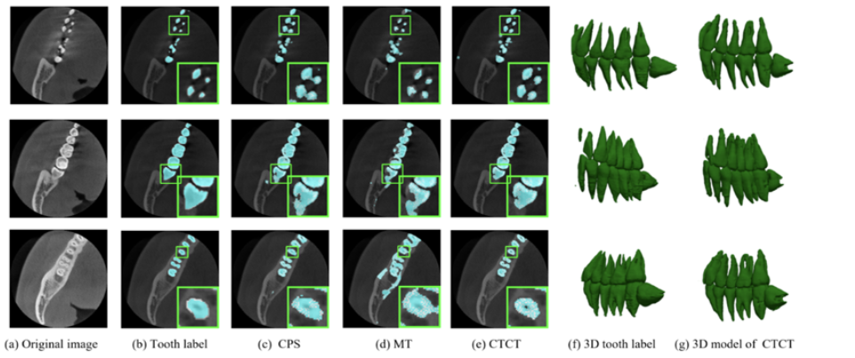
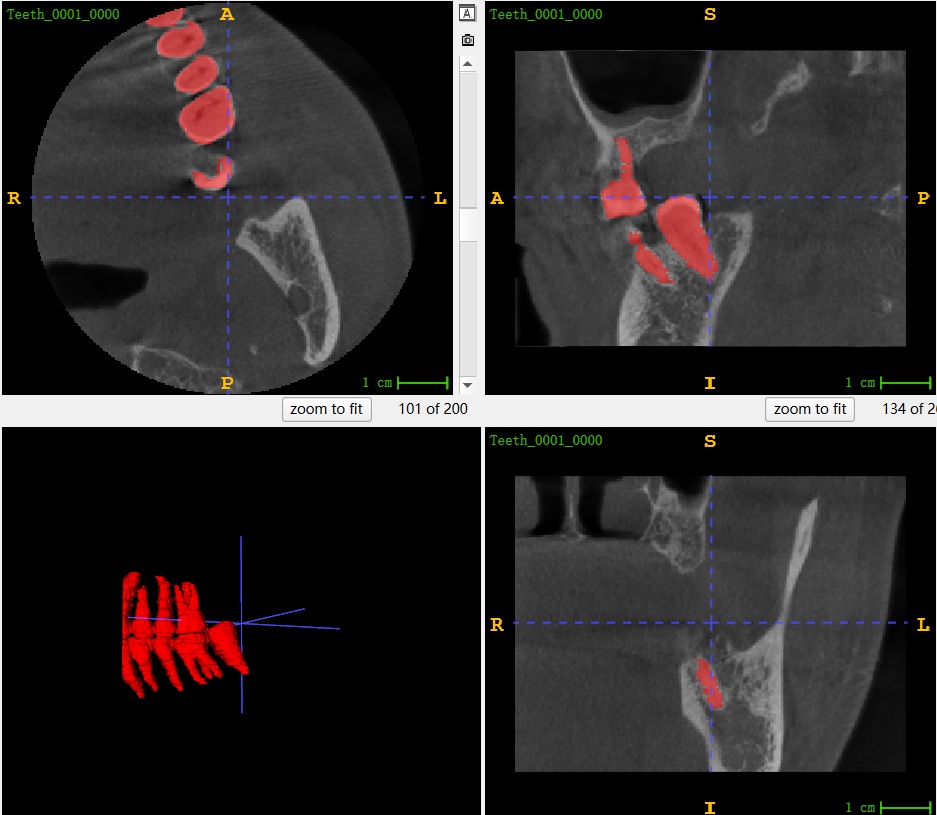

# 基于Pytorch的医学图像分割：

# 0.内容大纲

主要介绍基于3Dunet的医学图像分割示例。
本文以CBCT 3D牙齿分割为示例。
数据集参考阿里天池的数据，MICCAI 2023 Challenges ：STS-基于3D CBCT的牙齿分割任务：https://tianchi.aliyun.com/competition/entrance/532087

结果展示：

# 1.3D医学图像分割操作实例-以3D牙齿分割为例

代码使用步骤：
假设目前，你已经将数据下载下来，为nii.gz格式数据。该项目代码将从以下五个步骤进行分割训练与推理。

- 1，数据预处理：3D数据增强--->标准化---->resize----> 保存为.npy
  - 3D数据增强：   dataprocess/Augmain.py
  - 标准化和resize  以及保存npy : dataprocess/data3dprocesswithsize.py
- 2，将训练集，验证集 文件路径写入excel表中，便于读取加载。
  - test.py 写入excel文件 
- 3，模型训练，(如果使用服务器可以写一个run.sh的shell脚本)
  - train.py 可以使用run.sh提交； 
- 4，查看模型训练效果，调参等；
  - 模型输出log文件夹
- 5，模型推理，读取nii.gz数据，转成npy，然后再送入加载的模型，输出npy再转成nii.gz格式数据
  - inference.py  

